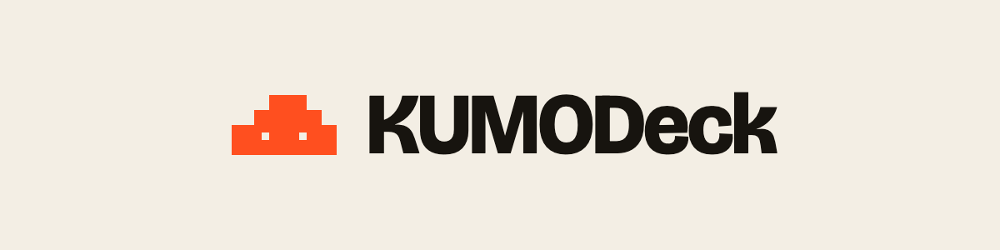

<p align="center">
  <picture>
    <source media="(prefers-color-scheme: dark)" srcset="assets/kumodeck-logo-dark.png">
    
  </picture>
</p>

# KUMODeck plugin

Make a web app or a game with an AI chat, and put it online with KUMODeck.

This plugin gives the AI two things:

- **Step-by-step guides (Skills)** for working with KUMODeck: start a new app or game, put it online, fix errors, save
  each player's data, add sign-in, make a game playable online with friends, rankings, chat, your own server code and
  database, and what to do when something is too big or too fast.
- **The KUMODeck connector** (`https://mcp.kumodeck.com/mcp`), so the AI can make your app or game on KUMODeck and put
  it online for you, right from the chat. The first time, you sign in to KUMODeck in your browser.

## Claude Code

Type these two lines in Claude Code:

```
/plugin marketplace add kumodeck/kumodeck-plugin
/plugin install kumodeck@kumodeck
```

Then ask, for example: "Build a small puzzle game on KUMODeck and put it online."

To get the newest guides later: `/plugin marketplace update kumodeck`.

## Claude (claude.ai, the desktop app)

1. Open **Customize → Connectors** and choose **Add custom connector**.
2. Paste this address and press **Add**: `https://mcp.kumodeck.com/mcp`
3. Sign in to KUMODeck when the window opens.

On a Team or Enterprise plan, the owner adds the connector for everyone in **Organization settings → Connectors**;
then each person presses **Connect** and signs in.

Connectors added on the web or the desktop app also work in the Claude phone apps.

## ChatGPT

1. In **Settings → Security and login**, turn on **Developer mode** (Plus, Pro, Business, Enterprise and Edu plans).
2. Open **Plugins**, press **+**, give it the name `KUMODeck` and paste this address: `https://mcp.kumodeck.com/mcp`
3. Sign in to KUMODeck when the window opens.

## What is inside

| Folder or file | What it is |
| --- | --- |
| `skills/` | The guides. `skills/INDEX.md` lists them and says when each one is used |
| `.mcp.json` | The KUMODeck connector address |
| `.claude-plugin/` | The plugin's name card and the list Claude Code reads with `/plugin marketplace add` |

## Help

support@kumodeck.com

## License

MIT — see [LICENSE](LICENSE).
